

  

  <b>A♭</b>
  

  

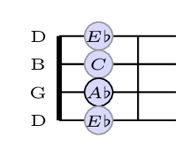
  

 

  

  <b>A</b>
  

  

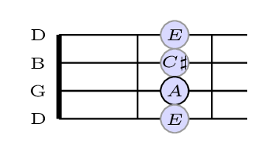
  

 

  

  <b>B♭</b>
  

  

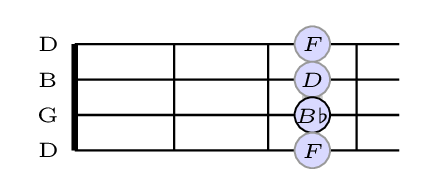
  

 

  

  <b>B</b>
  

  

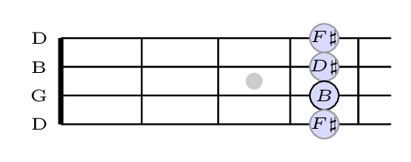
  

 

  

  <b>C</b>
  

  

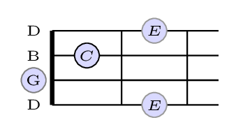
  

 

  

  <b>C♯</b>
  

  

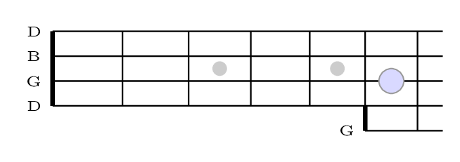
  

 

  

  <b>C major 7</b>
  

  

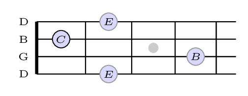
  

 

  

  <b>C major 7 fingering</b>
  

  

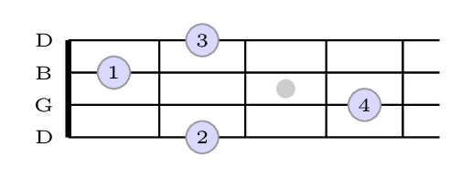
  

 

  

  <b>D♭</b>
  

  

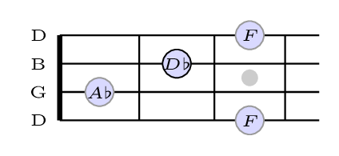
  

 

  

  <b>D</b>
  

  

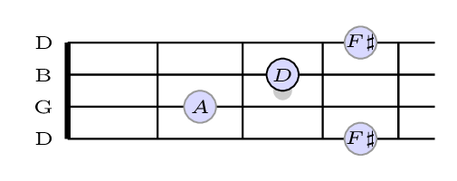
  

 

  

  <b>D♯</b>
  

  

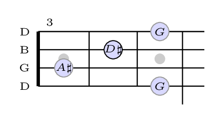
  

 

  

  <b>E♭</b>
  

  

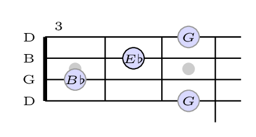
  

 

  

  <b>E</b>
  

  

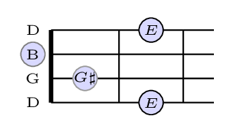
  

 

  

  <b>F♯</b>
  

  

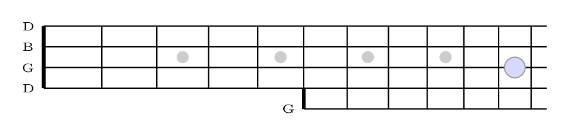
  

 

  

  <b>F</b>
  

  

  

 

  

  <b>G♭</b>
  

  

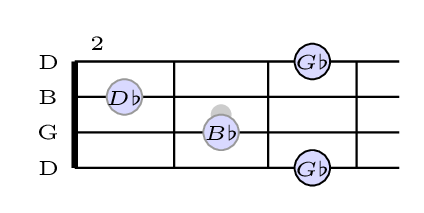
  

 

  

  <b>G</b>
  

  

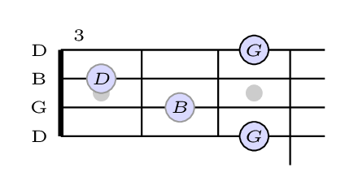
  

 

  

  <b>G♯</b>
  

  

  

 
