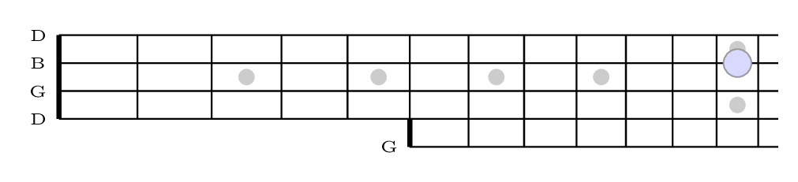
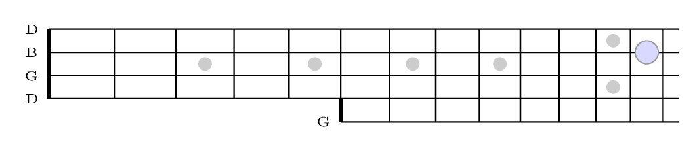
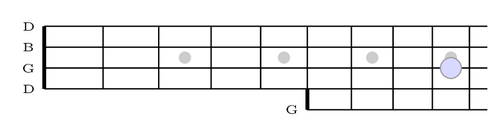

  

  <b>A♭</b>
  

  

  

 

  

  <b>A</b>
  

  

  

 

  

  <b>Amaj7</b>
  

  

  

 

  

  <b>B♭</b>
  

  

  

 

  

  <b>B♭maj7</b>
  

  

  

 

  

  <b>B</b>
  

  

  

 

  

  <b>Bmaj7</b>
  

  

  

 

  

  <b>C</b>
  

  

  

 

  

  <b>Cmaj7</b>
  

  

  

 

  

  <b>C♯</b>
  

  

  

 

  

  <b>C♯maj7</b>
  

  

  

 

  

  <b>D♭</b>
  

  

  

 

  

  <b>D♭maj7</b>
  

  

  

 

  

  <b>D</b>
  

  

  

 

  

  <b>Dmaj7</b>
  

  

  

 

  

  <b>D♯</b>
  

  

  

 

  

  <b>D♯maj7</b>
  

  

  

 

  

  <b>E♭</b>
  

  

  

 

  

  <b>E♭maj7</b>
  

  

  

 

  

  <b>E</b>
  

  

  

 

  

  <b>Emaj7</b>
  

  

  

 

  

  <b>F</b>
  

  

  

 

  

  <b>Fmaj7</b>
  

  

  

 

  

  <b>F♯</b>
  

  

  

 

  

  <b>F♯maj7</b>
  

  

  

 

  

  <b>G♭</b>
  

  

  

 

  

  <b>G♭maj7</b>
  

  

  

 

  

  <b>G</b>
  

  

  

 

  

  <b>Gmaj7</b>
  

  

  

 

  

  <b>G♯</b>
  

  

  

 

  

  <b>G♯maj7</b>
  

  

  

 
