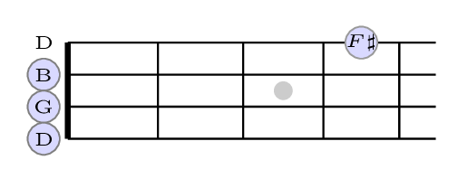

Banjo chord diagram generation liberally sourced from https://tex.stackexchange.com/questions/500427/drawing-an-accurate-guitar-fretboard-with-tikz

## Example

## Building
    git submodule update --init --recursive
    perl generate_major_chord.pl # generate Makefile and generate_anki_deck.py
    make -C build                # generate pngs
    cd build && python3 generate_anki_deck.py # build Anki deck

